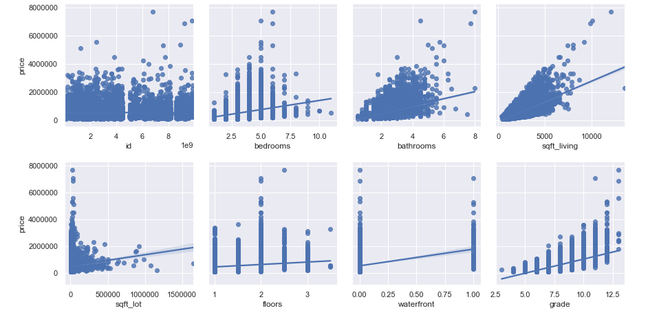
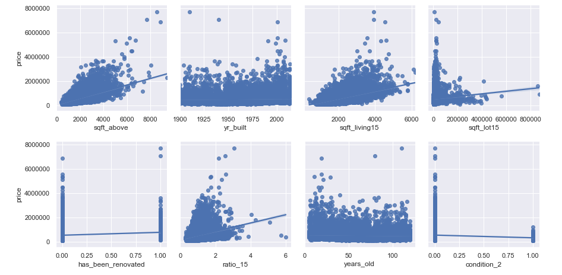
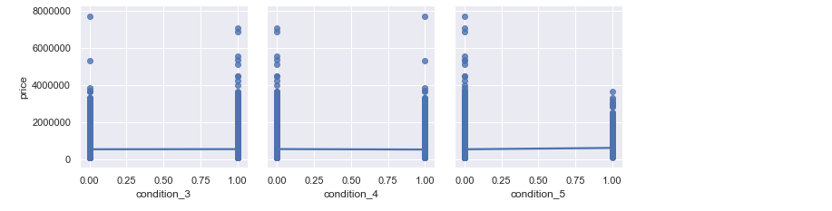
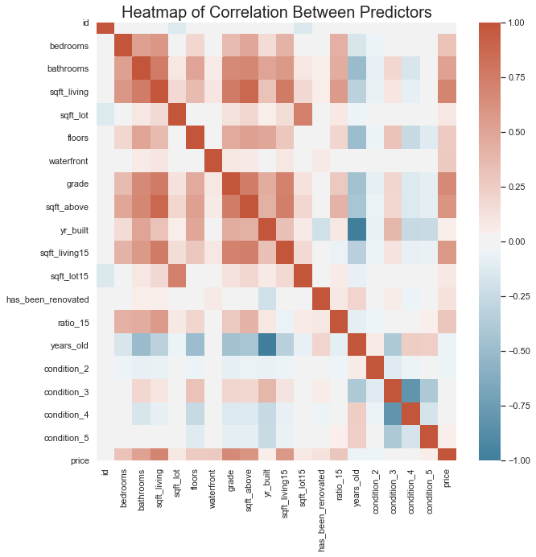
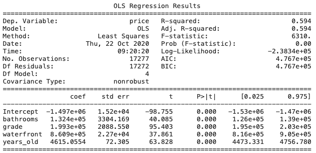

# Predicting Housing Prices in King County, WA

**Authors**: Griffin Hundley, Malcolm Katzenbach, Lauren Phipps


## Repository Structure

```
├── README.md                           <- The high-level overview of this project
├── Housing_Prices_Presentation.pdf     <- PDF version of project presentation
├── data                                <- Sourced externally and generated from code
├── images                              <- Both sourced externally and generated from code
├── notebooks                           <- All notebooks used in this project, including the Final_Notebook
└── src                                 <- Code files referenced in project
```

## Overview

This project analyzed housing data from King County, WA from 2014-2015. It was used to create a housing price predicting model. Realtors can use this model to accurately price new homes that are entering the market. Fairly priced homes will allow homes to sell quickly and maximize the return for the seller and the realtor. As houses take longer to sell, the price of the home decreases. This project aims to combat that issue. Previous housing data was used to determine which housing features have the highest impact on the price, as well as the amount of impact the features have. It was found that using the features of bathrooms, waterfront, years old, and housing grade created the best model. This model was able to attribute 42% of the changes in the houses prices to those four features. It was also found that each additional bathroom increases the price of a house by \\$132,400, an improvement of one level of the housing grade amounts to a \\$199,300 increase, a waterfront home is valued \\$806,900 more than a home not on the waterfront, and for each year the house ages, the price increases by \\$4,615. Realtors can use this model as a starting point for pricing new houses. However, further investigation should be done into the impact of location and the interaction of features to create an even better fit.

## Business Problem

When listing a house on the market, it is important to price it accurately. Houses that are priced too high can sit on the market for months, which can lead to the price eventually being dropped to generate sales. According to a study from Zillow, in the Seattle area, a house that is on the market for 2 months will lead to a 5% drop in price. On the other side, if a house is priced too low, a seller is not maximizing the return on their house. In both of these cases, the seller is not getting as much money as they can and the realtor is not maximizing their comission for the sale, as commission is tied to selling price.

To combat this, we are creating a model to estimate the price of a home based on certain characterisitics of the house. This will allow realtors to more accurately price the house to ensure it sells quickly and at a fair price.

The questions we are targeting are:

1) Which house features most impact the price of house?

2) How do these feature impact the price of a house?

3) Do renovations significantly increase the price of a home?

By answering these questions we will be able to give an accurate price of house for listing agents.

## Data Understanding

The data being used is publicly available housing data from King County, Washington from 2014-2015. The dataset contains ~21,600 rows, with each row representing the sale of a house in King County. The columns represent features of that house. The target variable is the price of the house, which will be used to determine the effect of several features on houses.

The features in the data set are as follows: 

```'id', 'date', 'bedrooms', 'bathrooms', 'sqft_living','sqft_lot', 'floors', 'waterfront', 'grade', 'sqft_above', 'yr_built', 'sqft_living15', 'sqft_lot15', 'has_been_renovated', 'ratio_15', 'years_old', 'condition_2', 'condition_3', 'condition_4', 'condition_5'
     ```


## Data Preparation

We began our preparation of the data by dropping the following columns: `view`, `lat`, `long`, `zipcode`, and `sqft_basement`.  `view` is not a feature of the house so it was dropped.  `lat`, `long`, and `zipcode` were dropped because the location is out of the scope of this project. `sqft_basement` was dropped because most houses didn't have basements

We then created two new features. First is `ratio15`, which is the ratio of the size of the house compared to the homes around it, using the `sqft_living` and `sqft_living15`. The other is `years_old`, with the year built subtracted from 2020. We then cleaned the data by changing the date to a datetime datatype and filling in the null values for `waterfront`. Lastly, we created dummy variables for the `condition`. 


## Results

Prior to modeling, we first looked at the relationship between housing price and each of the different features to get a starting point for our model. From here, we saw that living space seems to have the strongest correlation, and that there is a somewhat linear relationship between price and bathrooms and grade, as well.





Next, we investigated collinearity between the different features to determine ensure that collinear features are not used together in the model. This was done using the heatmap below. 



From this heatmap, we can eliminate using any pairs of features that have correlation coefficient with an absolute value of greater than 0.7.

After several iterations, the model that was the strongest fit is shown below. It contains the features: `bathrooms`, `grade`, `waterfront`, and `years_old`. There was an r-squared value of 0.594, which indicates that 59.4% of the variance in the price is attributed to changes in these variables. Additionally, all these variables were statistically significant, as seen in their p-values. 

From this model, it can be found that each additional bathroom increases the price of a house by \\$132,400. An improvement of one level of the housing grade amounts to a \\$199,300 increase in the price. A waterfront home is valued \\$806,900 more than a home not on the waterfront. Lastly, for each year the house ages, the price increases by \\$4,615.




## Evaluation

## Conclusions

## Next Steps